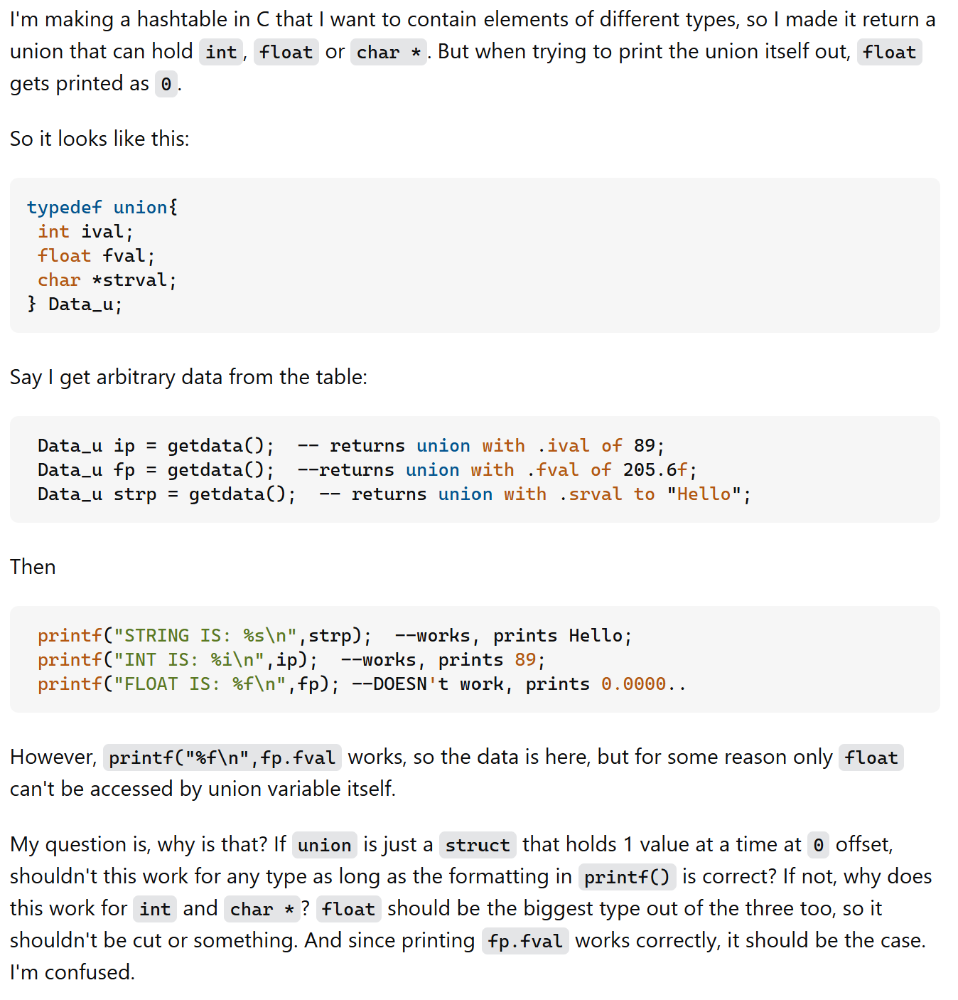
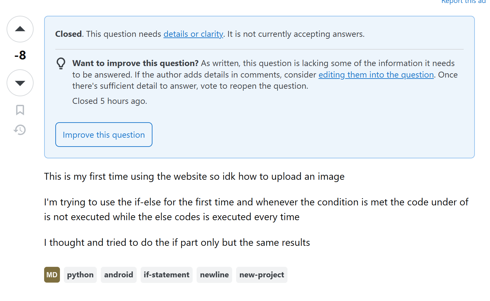

## "There are no stupid questions right?"

Well, sort of. Questions are how we all learn things and being curious is definetely much more of a good trait to have than a bad one. Everybody is a beginner at some point, and even the most simple questions to anyone experienced enough may leave a newbie stumped. Eric Steven Raymond- although a controversial somewhat controversial figure, gives great points. "Try to search for the answer on google first, try reading a manual, try ask a friend, don't ask multiple websites, don't spam a question forum, don't post a question that is off topic, etc." If it's a very basic question, while someone before you was probably the first ask, then there is most likely an easy answer to that online. Be as detailed as possible. You can't expect someone to understand your question if you're vague about it. Send questions in accessible format plain text. Just ask the question how it is in as much detail as possible, be patient, and of course, be nice about it. 

## What does a good question look like?

From user Gilly on StackOverflow: 

                                                                                                                                                     
                                                                                                                                                     
A good question, polite, and concise. They provided their code in a readable format, and explained exactly what they were having trouble with. No wonder they got many upvotes and responses! 

## Now what does a bad question look like?

From user بو جدوع on StackOverflow:

From what I understand, I don't. To be fair, judging by his name, English is not his first language, and I assume he hasn't read up on the rules of posting a question. Despite this, the question is very trivial, something a simple Google search could solve. They did not provide any code, and proof of error, and nothing to work with. 

So don't ask stupid questions guys!

